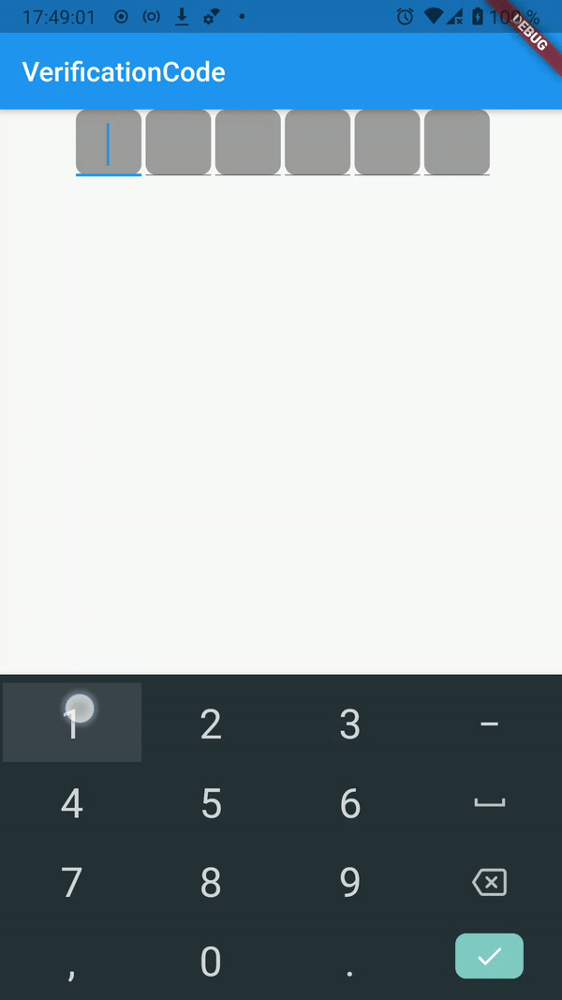

[](https://pub.dev/packages/verification_code_builder)

# verification_code_builder

Infinitely customizable widget for creating code input forms.

Inspired by [flutter_verification_code](https://pub.dev/packages/flutter_verification_code)

## Features
* Ability to define cell widgets using the builder callback. Only you have complete control over the behavior and look of your cells!
* Built in paste action support.
* Backspace press tracking. Especially useful if you don't like the extra "clear all" button.
* Automatic focus control. You don't need to define the focus switching logic yourself. All you need to do in your cell widgets is to call the `focus.nextFocus()` when the input to the current field is complete - verification_code_builder will take care of the rest.

## WIP
1. Support for derived number of characters in cells
2. Cells RegExp and `onError` callback support
3. `isEditing` flag
4. `getCurrentIndex` method
5. Logo
6. License

## Usage
1) Import the library:
```dart
import 'package:verification_code_builder/verification_code_builder.dart';
```

2) Use `VerificationCode` wherever you want:
```dart
@override
Widget build(BuildContext context) {
  return Scaffold(
    appBar: AppBar(
      title: Text('VerificationCode'),
    ),
    body: Center(
      child: VerificationCode(
        length: 6, // Set the number of cells
        onCompleted: (String value) {
          print("Code is $value"); // Set a callback for the result
        },
        builder: (index, focus, textEditingController, pasteMethod) { // Construct your cell widget
          return _generateSingleDigit(index, focus, textEditingController, pasteMethod);
        },
      ),
    )
  );
}

Widget _generateSingleDigit(
  int index, // Cell index in VerificationCode widget
  FocusNode focus, // Focus for "this" cell. VerificationCode use it to manage focus of cells
  TextEditingController textEditingController, // Cell input handler
  PasteMethod pasteMethod // Paste mechanism. Use it for perform paste (e.g. using SelectionControls)
) {
  return Container(
    height: 48,
    width: 48,
    margin: EdgeInsets.only(left: 3),
    decoration: BoxDecoration(
      borderRadius: BorderRadius.all(Radius.circular(8)),
      color: Colors.grey),
    child: Center(
      child: TextField( // If you build your cell based on TextField...
        controller: textEditingController, // just insert textEditingController parameter here
        focusNode: focus, // and focus here
        autofocus: index == 0, // You can use index to perform autofocus on first cell
        // Use this custom SelectionControls widget for easily "native-like" paste experience
        selectionControls: VerificationSelectionControls.create(pasteMethod),
        inputFormatters: [FilteringTextInputFormatter.digitsOnly, LengthLimitingTextInputFormatter(1)],
        keyboardType: TextInputType.number,
        textAlign: TextAlign.center,
        style: TextStyle(
          color: Colors.black,
          fontSize: 30,
          fontWeight: FontWeight.w700,
        ),
        onChanged: (str) => {
          if (str.isNotEmpty) {
            index == 5 ? FocusScope.of(context).unfocus() : focus.nextFocus()
          }
        },
      ),
    ),
  );
}
```

## Showcase


## Contributing
I will be glad to hear about your successes, ideas and problems that you have encountered while using this widget. You can contact me on [Twitter] and share your experience. I will also be very happy if you send me a small video or gif on which you will show what form for entering the code you got. If you find a bug, please describe it (either on [GitHub], or on [Twitter]). Pull requests with bug fixing and improvements are strongly encouraged and I will be happy to leave a mention of your contribution in the README. I will also be glad to any spelling corrections :)

[Twitter]: https://twitter.com/RareScrap_ru
[GitHub]: https://github.com/RareScrap/verification_code_builder